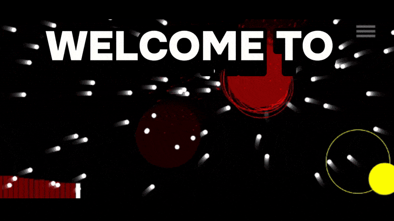

## I'm beginning JS/React/Node.js dev. Currently loooking for a job.

**My biggest project yet**

### Sound Based Game

Fully made using canvas element, the whole concept is based on the idea that user can choose any music on his devise and game will play as intense as music is.
It adapted both for mobile and PC.

[You can try it yourself here](https://onlinesoundgame.onrender.com/)
##

**Currently working on**

### Fullstack chat-app

Using React for front-end, Node.js for back-end and MySQL data base.

Implemented things so far:
-basic login/registration process, confirmation via code send by email.
-searching users
-basic chat between two users(reactions, replying, deleting messages, notifications, deleting chat, banning user etc.)
-adding user-icon

Planning to implement:
-posts
-group chats
and more.

[You can check it if you want](https://fullstuck-chat-render-client.onrender.com/), but as mentioned above it still unfinished.

<!--
**Bruhmanishe/Bruhmanishe** is a ✨ _special_ ✨ repository because its `README.md` (this file) appears on your GitHub profile.

Here are some ideas to get you started:

- 🔭 I’m currently working on ...
- 🌱 I’m currently learning ...
- 👯 I’m looking to collaborate on ...
- 🤔 I’m looking for help with ...
- 💬 Ask me about ...
- 📫 How to reach me: ...
- 😄 Pronouns: ...
- ⚡ Fun fact: ...
-->
